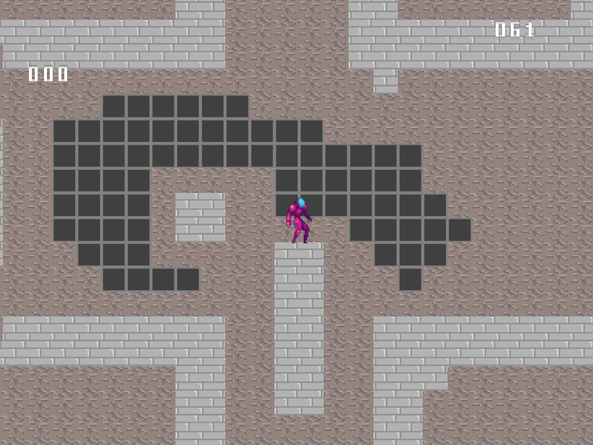

Side scrolling game. Basic real time 2D renderer written from scratch using Win32, Direct3D 11, XAudio for sound and HLSL in C/C++.

Instructions: Control with WASD keys. Shoot with spacebar.

Features:
- Flipbook style sprite animation
- Collisions with environment and enemies
- Upwards and downwards  forces

Screenshots:

